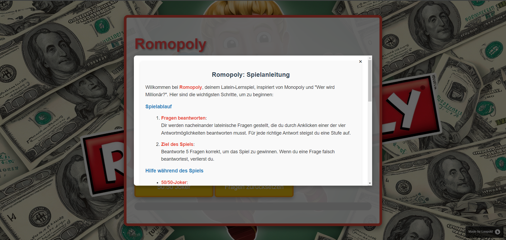
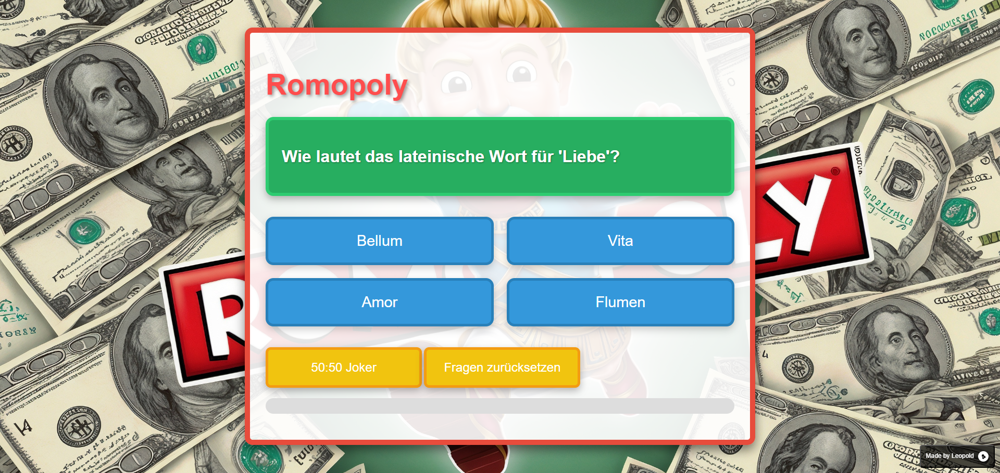

# 🎲 Romopoly - Latein-Lernspiel

Willkommen bei **Romopoly**, einem interaktiven Latein-Lernspiel, das von Monopoly und "Wer wird Millionär?" inspiriert ist. Verbessere dein Latein, indem du spannende Fragen beantwortest, während du durch die Spielstufen fortschreitest. 💡

---

## 🚀 Features

- ✨ **Lateinische Fragen**: Beantworte spannende Latein-Fragen, um zu gewinnen!
- 🃏 **50/50-Joker**: Nutze den Joker, um zwei falsche Antworten zu eliminieren.
- 🎉 **Konfetti-Effekt** bei Gewinn!
- 📱 **Responsive Design**: Spielbar auf PC, Tablet und Smartphone.
- 👤 **First Visit Pop-up**: Zeigt beim ersten Besuch ein Tutorial-Pop-up an.
- 🖱️ **Custom Cursor**: Custom Cursor auf der Website, der sich bei Buttons verändert.
- 🔄 **Fragen zurücksetzen**: Es wird keine Frage doppelt angezeigt. Wenn alle aufgebraucht wurden, kann man diese wieder zurücksetzen um wieder alle zu verfügung zu haben.
- 🔄 **Fragen zufällig mischen**: Die Fragen werden bei jedem Neustart zufällig gemischt.

---

## 📸 Screenshots

 

---

## 🌐 Website

Du kannst das Spiel direkt hier spielen: [Romopoly](https://romopoly.madebyleopold.me)

---

## 📚 Anleitung

1. **Fragen beantworten**: Wähle die richtige Antwort aus vier Optionen.
2. **50/50-Joker**: Entferne zwei falsche Antworten und erhöhe deine Gewinnchancen.
3. **5 richtige Antworten** = Gewinn! 🎉
4. **Verloren?**: Keine Sorge, du kannst jederzeit neu beginnen.

---

## 🛠 Technologien

- HTML
- CSS (mit Grid und Media Queries)
- JavaScript (für Interaktivität und Spielmechanik)

---

## 📝 To-Do's & Ideen

- [ ] Weitere Fragen hinzufügen
- [ ] Verschiedene Schwierigkeiten/Lektionen
- [ ] Pop-Up Anpassung für Handys

---

## 🎓 Credits

- Entwickelt von [Leopold](https://github.com/MadebyLeopold)
